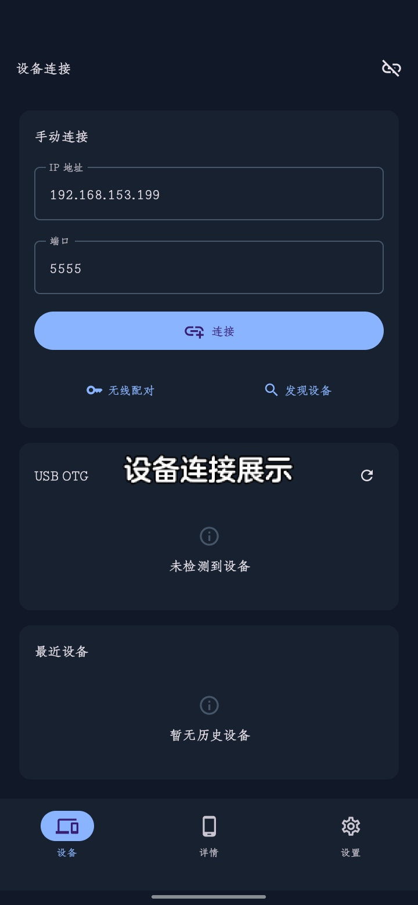
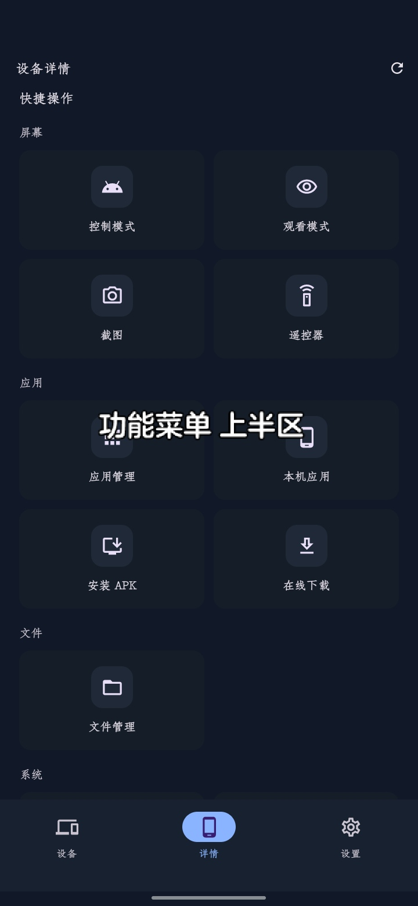
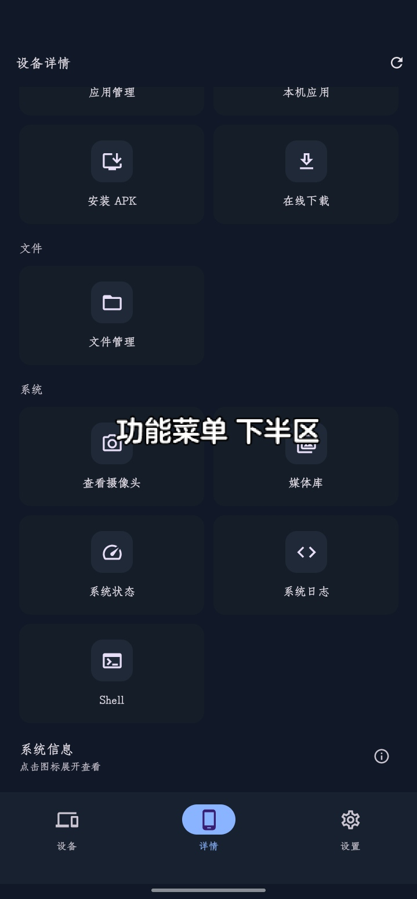
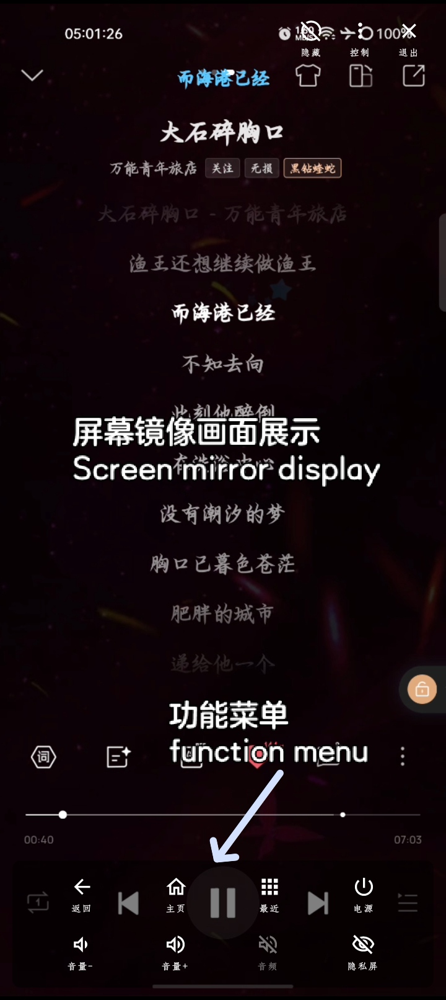
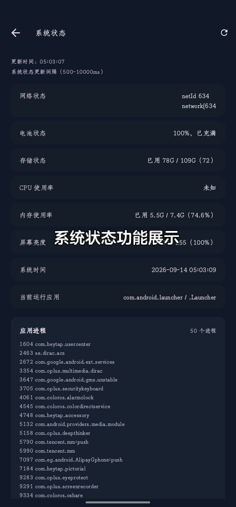
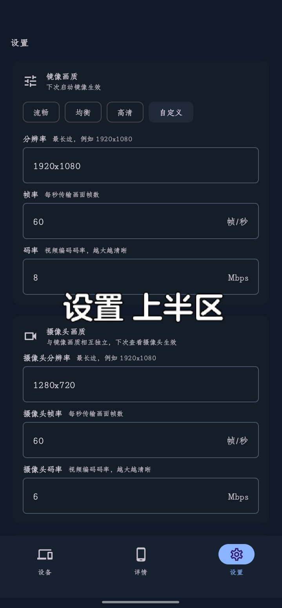
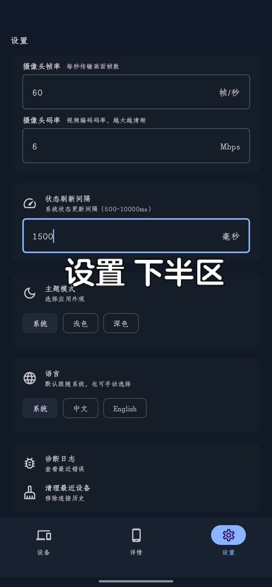
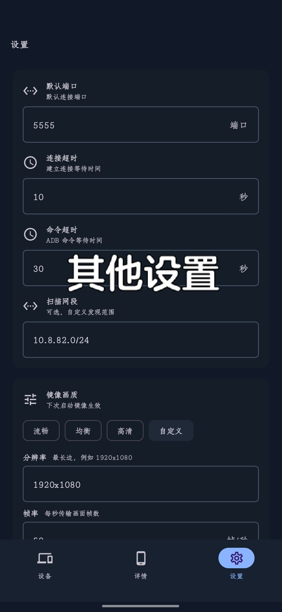

# SkyADBPro

<p align="center">
  
</p>

SkyADBPro，基于 SkyADB 进行优化改进的版本，快捷高效的在 Android 设备之间进行 ADB 调试，内置丰富功能可供直接使用或二次开发！

SkyADBPro is an optimized and improved version of SkyADB, designed for fast and efficient ADB debugging across Android devices; it comes with a rich set of built-in features ready for immediate use or further development.

---

## 功能特性 / Features

- **无线调试配对**：输入配对 IP、配对端口、配对码后调用 Kadb Pairing。
- **手动连接**：输入目标设备 IP 和 ADB 端口（默认 5555）。
- **USB OTG**：识别 ADB / Fastboot 接口，授权后连接。
- **最近设备**：自动保存连接历史，一键回填。
- **局域网发现**：NSD / mDNS 自动发现 `_adb._tcp.` 等服务，支持网段扫描兜底。
- **设备详情**：品牌、型号、Android 版本、SDK、ABI、分辨率、电池信息。
- **控制模式**：基于 scrcpy 的屏幕镜像，支持远程触控、音频转发与中文输入。
- **观看模式**：纯观看目标设备屏幕，无控制权限干扰。
- **截图**：调用 `screencap` 拉取预览，需要时保存到本机。
- **虚拟遥控器**：模拟返回、主页、方向键、音量、媒体控制等常用按键。
- **应用管理**：应用列表、分类筛选、搜索、启动、停止、卸载。
- **本机应用**：列出本机用户应用，导出并安装到目标设备。
- **安装 APK**：选择本机 APK 安装到已连接设备。
- **在线下载**：从 HTTP / HTTPS 链接下载 APK 或文件，支持进度、取消、下载后安装或推送。
- **文件管理**：浏览目标设备目录、上传、下载、新建文件夹、删除文件。
- **查看摄像头**：查看目标设备前置 / 后置摄像头画面。
- **媒体库**：浏览目标设备媒体文件。
- **系统状态**：网络、电池、存储、CPU、内存、屏幕亮度、当前应用与进程列表实时监控。
- **系统日志**：读取目标设备系统日志并支持复制。
- **Shell**：执行 Shell 命令，展示输出、错误输出与退出码。
- **诊断日志**：记录错误和异常信息，便于排查连接和功能异常。
- **设置**：默认端口、连接超时、命令超时、扫描网段、镜像画质（流畅 / 均衡 / 高清 / 自定义）、摄像头画质、状态刷新间隔、主题模式、语言、清理最近设备。

## 效果展示 / Screenshots

### 设备连接 / Device Connection

手动连接（IP + 端口）、无线配对、发现设备、USB OTG 与最近设备管理。

<p align="center">
  
</p>

### 功能菜单 / Function Menu

控制模式、观看模式、截图、遥控器、应用管理、本机应用、安装 APK、在线下载、文件管理、查看摄像头、媒体库、系统状态、系统日志、Shell 等入口。

<p align="center">
  
  
</p>

### 屏幕镜像 / Screen Mirror

控制模式实时镜像目标设备屏幕，支持沉浸效果展示与遥控操作。

<p align="center">
  
  
</p>

### 系统状态 / System Status

网络、电池、存储、CPU、内存、屏幕亮度、系统时间、当前运行应用与应用进程列表。

<p align="center">
  
</p>

### Shell 命令 / Shell Command

执行 Shell 命令并查看输出结果与历史命令。

<p align="center">
  
</p>

### 设置 / Settings

连接参数、镜像画质、摄像头画质、状态刷新间隔、主题模式、语言等。

<p align="center">
  
  
  
</p>

## 下载 / Download

- **SkyADB-Pro-0.2.0-release.apk**：`SkyADB-Pro-0.2.0-release.apk`（仓库根目录）
- 也可前往 Releases 页面获取最新版本。

## 如何使用 / Usage

1. 在目标设备开启开发者选项和无线调试（Android 11+ 推荐使用无线调试配对）。
2. 在 SkyADBPro 中输入目标设备 IP 和 ADB 端口，或先使用无线调试配对 / 发现设备。
3. 连接成功后进入设备详情页，使用控制模式、观看模式、应用管理、APK 安装、文件管理、截图、遥控器、屏幕镜像或 Shell 等功能。
4. 常用设备会自动保存到最近设备列表，后续可快速回填连接信息。

## 构建 / Build

```bash
# 使用 JDK 17+ 与 Android SDK
./gradlew assembleRelease
```

签名所需密钥通过环境变量注入，不会写入源码：

```bash
export SIGNING_STORE_FILE=/path/to/keystore.jks
export KEY_ALIAS=alias
export KEY_STORE_PASSWORD=password
export KEY_PASSWORD=password
./gradlew assembleRelease
```

## 技术栈 / Tech Stack

- Kotlin
- Jetpack Compose + Material 3
- Navigation Compose
- Lifecycle ViewModel + StateFlow
- Kotlin Coroutines / Flow
- DataStore Preferences
- Kadb 2.1.3
- scrcpy-server 4.1
- OkHttp 5.3.2
- Timber
- JUnit

## 运行范围 / Runtime Scope

- 运行设备：最低 Android 7.0（API 24）。
- 编译目标：compileSdk 37，targetSdk 37。
- Android 17 局域网：需声明并运行时申请 `ACCESS_LOCAL_NETWORK`，用于 mDNS 发现、网段扫描和 WiFi ADB 连接。
- 被连接设备：以目标设备是否支持 ADB over TCP / Wireless Debugging 为准。

## 鸣谢 / Credits

- [Kadb](https://github.com/flyfishxu/Kadb)
- [scrcpy](https://github.com/Genymobile/scrcpy)

## 开源协议 / License

[](LICENSE)

本项目基于 [SkyADB](https://github.com/sky22333/skyadb) 进行优化改进，遵循 **GNU General Public License v3.0**（GPL-3.0）规范许可证发布。

- **SPDX 标识**：`GPL-3.0-only`
- **版权声明**：
  - Copyright (C) 2026 github.com/sky22333 (SkyADB)
  - Copyright (C) 2026 CN-QiuWan (SkyADBPro)
- **许可要点**：
  - 你可以自由使用、修改、分发本软件；
  - 分发时必须保留版权声明与本许可证全文；
  - 修改后的衍生作品必须以 GPL-3.0 相同的许可协议开源；
  - 本项目不提供任何担保。

完整许可条款见 [LICENSE](LICENSE) 文件。

